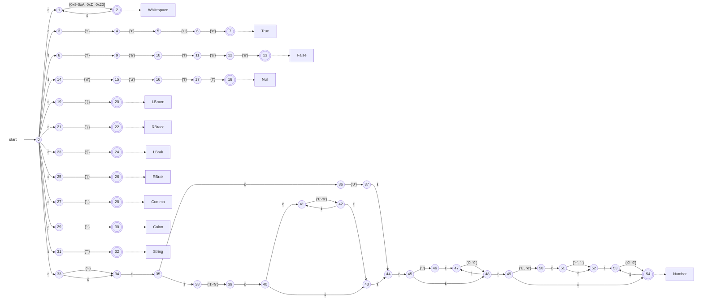
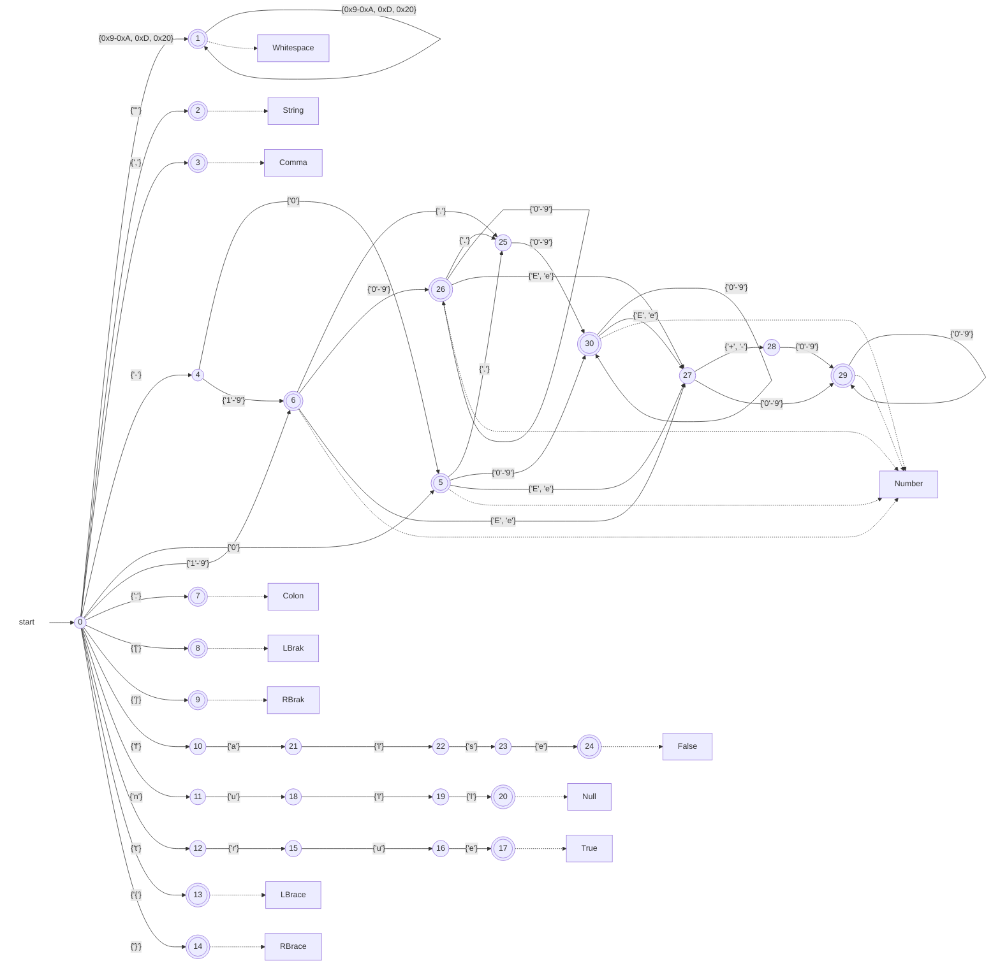
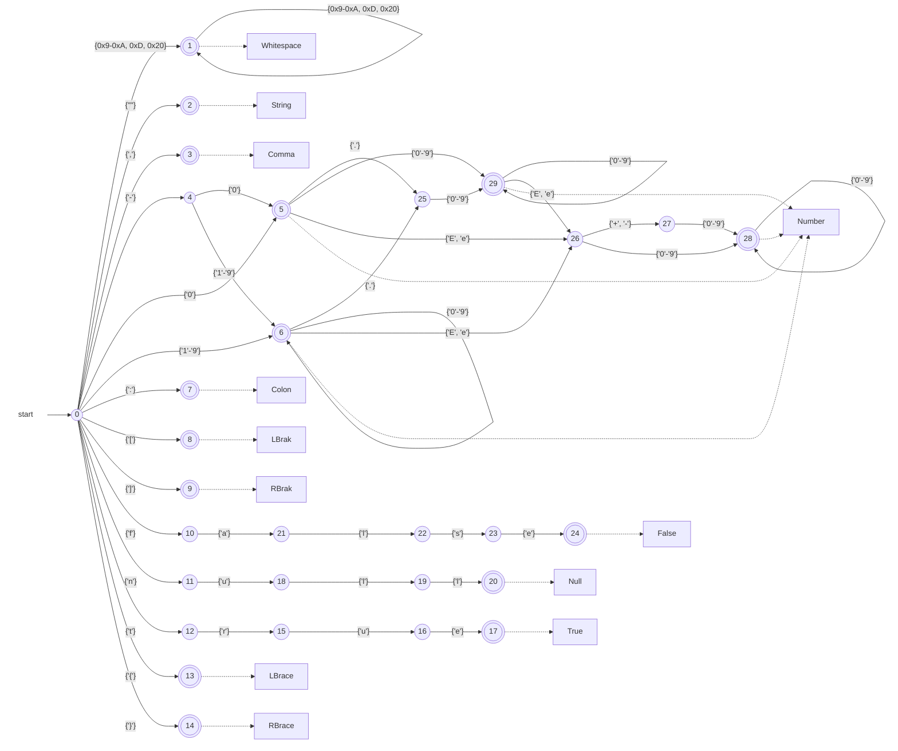

# Herring
[](https://crates.io/crates/herring)
[](./LICENSE-MIT)
[](https://crates.io/crates/herring)
<!--[](https://github.com/0x2a-42/herring/actions)-->

[Herring](https://en.wikipedia.org/wiki/Herring) (**H**ighly **E**fficient **R**ust **R**egex-based lexer **I**mplementatio**N** **G**enerator) is a lexer generator for Rust implementing a subset of the [Logos](https://github.com/maciejhirsz/logos) API.

The key differences compared to Logos are the following.

- The `Herring` trait must be derived on a [unit-only enum](https://doc.rust-lang.org/reference/items/enumerations.html#r-items.enum.unit-only).
- Only `Result<TokenType, ErrorType>` is allowed for a `regex` or `token` callback return type.
- Lexer modes (`morph` method) are not supported (use callbacks and `extras` instead).
- There is no `ignore(ascii_case)`, only `ignore(case)`.

These changes are mostly due to the use case as a lexer for the [Lelwel](https://github.com/0x2a-42/lelwel) parser generator, where unit-only enums are required.
There are also additional features that are not available in Logos.

- There is an `ignore` callback that can be used to skip input before it is passed to the automaton (e.g. for lexing [escaped newlines](./tests/ignore.rs) in C).
- There is an `initial` callback that can be used for generating tokens without consuming input (e.g. for [indent and dedent tokens](./tests/initial.rs) in Python).
- A callback with unit return type can be specified for `skip` regexes.

> [!WARNING]
> At the moment you should almost certainly use Logos instead of Herring, as it is more mature and provides better performance.
> There are however also valid reasons for using Herring.
> There are currently some bugs in Logos related to [backtracking](https://github.com/maciejhirsz/logos/issues?q=is%3Aissue+is%3Aopen+backtracking) and [stack overflows](https://github.com/maciejhirsz/logos/issues?q=is%3Aissue+is%3Aopen+stack+overflow) that [are not present](./tests/logos_bugs.rs) in Herring.
> You may also use Herring if you require the `ignore` or `initial` callbacks.

## Performance
### Runtime
Herring implements some of the optimizations also present in Logos.
These are jump tables for states with many outgoing transitions and stacked lookup tables for transitions with complicated byte ranges.
It does currently not implement some other optimizations such as loop unrolling or transitioning on strings.

#### DFA Jump Threading
Unlike Logos, which encodes its state machine with mutually tail recursive functions, Herring uses a `match` inside of a `loop`.
This has the advantage, that the state machine will not overflow the stack on long inputs, if it is compiled without optimizations.
On the other hand a disadvantage is, that Rust currently does not optimize away the extra jumps (see https://github.com/rust-lang/rust/issues/80630 and https://github.com/rust-lang/rfcs/pull/3720).
By passing [`-enable-dfa-jump-thread`](https://github.com/llvm/llvm-project/commit/02077da7e7a8ff76c0576bb33adb462c337013f5) to LLVM it is however possible to enable this optimization on the LLVM level.
This can be achieved by adding a [`.cargo/config.toml`](./.cargo/config.toml) file to your crate.

> [!CAUTION]
> Be aware, that adding LLVM passes to the rustc optimization pipeline is probably not well tested and may increase the probability for running into compiler bugs.

#### Benchmark
The results of the [Logos benchmark](./benches/logos_benchmark.rs) on an Intel Core i7-8550U CPU are shown in the following table.
Currently in most cases Logos is faster than Herring with DFA jump threading.

| Benchmark | Without DFA Jump Threading | With DFA Jump Threading | Logos |
| --- | --- | --- | --- |
| `iterate/identifiers` | 1.9877 µs (373.75 MiB/s) | **878.93 ns (845.24 MiB/s)** | 951.53 ns (780.75 MiB/s) |
| `iterate/keywords_operators_and_punctators` | 6.1906 µs (328.28 MiB/s) | 2.8433 µs (714.76 MiB/s) | **2.6915 µs (755.08 MiB/s)** |
| `iterate/strings` | 2.0411 µs (406.97 MiB/s) | 1.0142 µs (818.99 MiB/s) | **717.31 ns (1.1309 GiB/s)** |

### Compile Time
Using complex unicode ranges or finite repetitions may result in large NFAs, for which the transformation to a minimized DFA may take a noticeable amount of time.
To improve build times you can add the following to your `Cargo.toml` file, so the procedural macro code is optimized.
```toml
[profile.dev.build-override]
opt-level = 3

[profile.release.build-override]
opt-level = 3
```

## Example
The Herring API is almost identical to the Logos API, so it can be used as a drop in replacement, if the above mentioned restrictions apply.

The following example shows a lexer for JSON (string escape sequences are not validated, as this is better handled [after lexing](https://github.com/0x2a-42/lelwel/blob/3b1abbf4f717bdcff1e9f66f05086e7365410eee/examples/json/src/parser.rs#L97-L145), to avoid tripping up the parser with a missing string token).
```rust
use herring::{Herring, Lexer};

#[derive(Debug, Clone, PartialEq, Default)]
pub enum LexerError {
    #[default]
    Invalid,
    UnterminatedString,
}
fn parse_string(lexer: &mut Lexer<'_, Token>) -> Result<Token, LexerError> {
    let mut it = lexer.remainder().chars();
    while let Some(c) = it.next() {
        match c {
            '"' => {
                lexer.bump(1);
                return Ok(Token::String);
            }
            '\\' => {
                lexer.bump(1);
                if let Some(c) = it.next() {
                    lexer.bump(c.len_utf8());
                }
            }
            c => lexer.bump(c.len_utf8()),
        }
    }
    Err(LexerError::UnterminatedString)
}
#[derive(Herring, Debug, PartialEq, Copy, Clone)]
#[herring(error = LexerError)]
pub enum Token {
    #[regex("[\u{0020}\u{000A}\u{000D}\u{0009}]+")]
    Whitespace,
    #[token("true")]
    True,
    #[token("false")]
    False,
    #[token("null")]
    Null,
    #[token("{")]
    LBrace,
    #[token("}")]
    RBrace,
    #[token("[")]
    LBrak,
    #[token("]")]
    RBrak,
    #[token(",")]
    Comma,
    #[token(":")]
    Colon,
    #[regex("\"", parse_string)]
    String,
    #[regex(r"-?(0|[1-9][0-9]*)(\.[0-9]+)?([eE][+-]?[0-9]+)?")]
    Number,
}
fn main() {
    for tok in Token::lexer(r#"{"test": [1,2,3]}"#) {
        println!("{tok:?}");
    }
}
```

## Debugging
You can inspect the generated code by running [`cargo expand`](https://github.com/dtolnay/cargo-expand).

You can generate [Graphviz](https://graphviz.org/) or [Mermaid](https://mermaid.js.org/) graphs by setting the environment variable `HERRING_DEBUG` to either `graphviz` or `mermaid` during the execution of the procedural macro.
This generates a file for the NFA (`nfa.dot` or `nfa.mmd`), the subset construction DFA (`dfa.dot` or `dfa.mmd`), and the minimized DFA (`min.dot` or `min.mmd`) in the specified format.
Graphviz is useful when debugging locally with tools like [`xdot`](https://github.com/jrfonseca/xdot.py).
Mermaid is useful for directly embedding graphs in Github issues.

Setting `HERRING_DEBUG` to `log` makes the lexer write all visited states to stderr.

> [!NOTE]
> When changing the `HERRING_DEBUG` environment variable you have to make sure that the build of the lexer is not skipped by `cargo build`.
> If you made no changes since the last build you can safe the containing file without any changes to trigger a rebuild.

### JSON Example
#### NFA


#### Subset Construction DFA


#### Minimized DFA


## License
Herring is licensed under either of

 * Apache License, Version 2.0
   ([LICENSE-APACHE](LICENSE-APACHE) or https://www.apache.org/licenses/LICENSE-2.0)
 * MIT license
   ([LICENSE-MIT](LICENSE-MIT) or https://opensource.org/licenses/MIT)

at your option.

## Contribution

Unless you explicitly state otherwise, any contribution intentionally submitted
for inclusion in the work by you, as defined in the Apache-2.0 license, shall be
dual licensed as above, without any additional terms or conditions.
